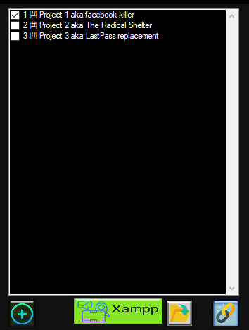

## Why

I needed a way to have the folder appear as the root path to test projects with and dealing with apaches vhosts is a pain in the A**.

---

## How

Using Symbolic links apache thinks its looking at one folder but we change out without having to copy and paste or edit config files.

---

## Setup

1. Install Xampp
2. Delete the htdocs folder
3. Run the app
4. Point the app at the Xampp folder
5. Add project folders
6. Be well (and start apache)

---

## Screenshots

---

## Current build

https://bitbucket.org/Madpeter/xampp-htdocs-project-switcher/src/master/xamp_project_switch/bin/Release/xamp_project_switch.exe

---

## Versions
1.0.0.0: First public version

---

With thanks to:

Icons - https://www.flaticon.com/authors/freepik

Fody | Costura (Single EXE packager) - https://github.com/Fody/Costura

---

My code is covered by: Creative Commons Attribution-ShareAlike 4.0 International License.  http://creativecommons.org/licenses/by-sa/4.0/
